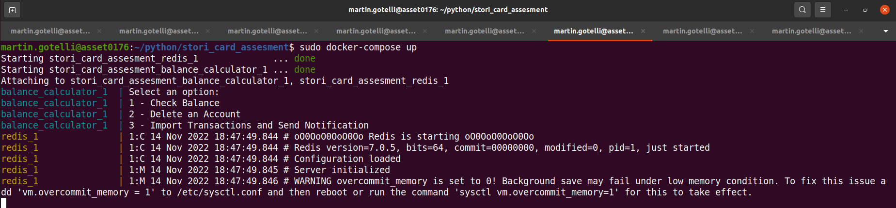
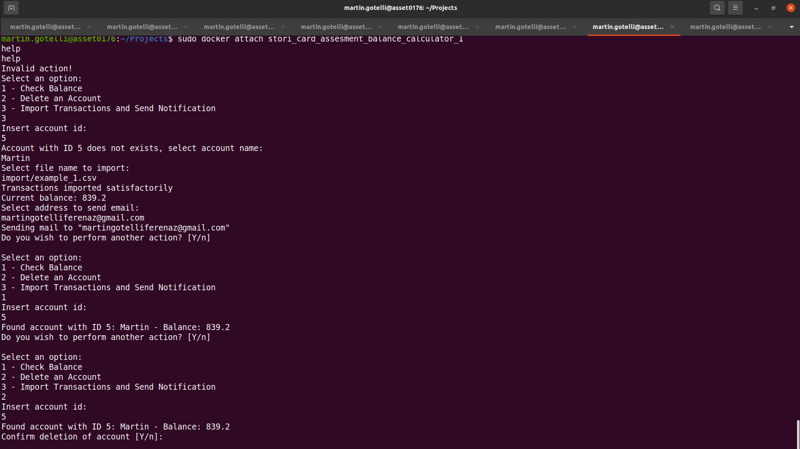
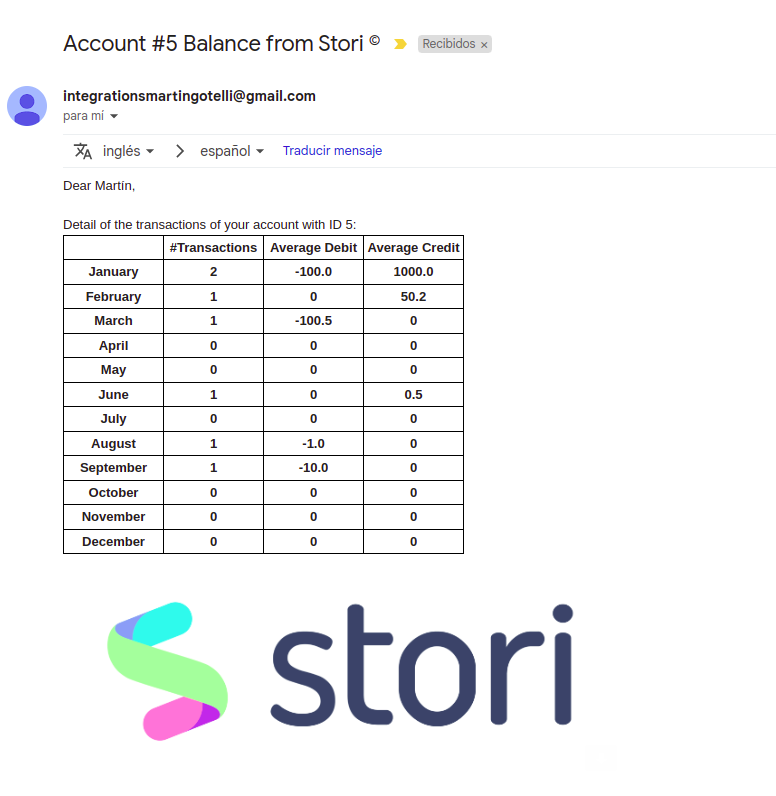

# Balance Calculator and Notification Sender

## How to Run?

Execute:

```
docker compose-up
```

In **another terminal**, after start up:

```
docker attach stori_card_assessment_balance_calculator_1
```

## Import File Format

The import file format is a comma separated CSV file, in the import folder there is an example.
Use this folder to add new import files.

## Example



